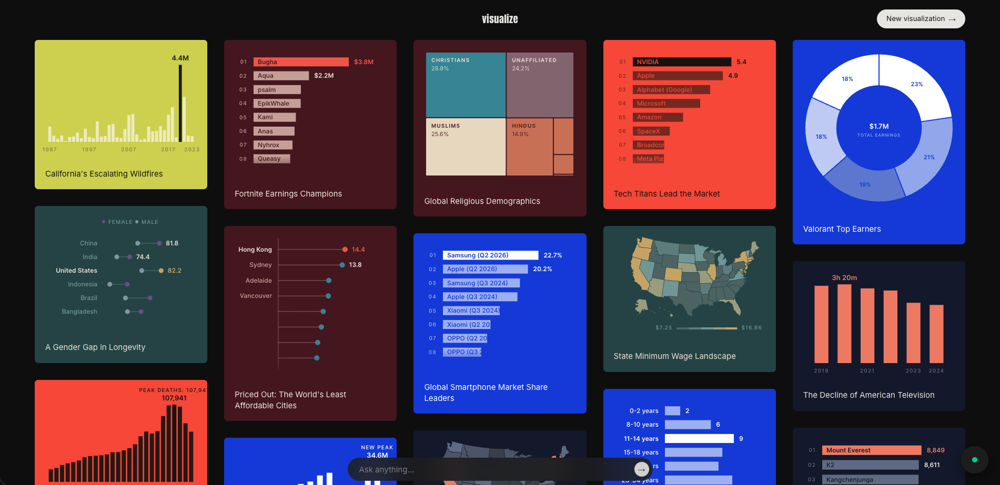
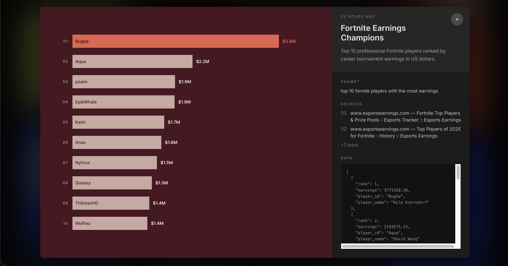

# Visualize





Pinterest for data visualization. An agent pipeline researches your query live on the web, picks the way to visualize the data, and renders an aesthetic visualization. The user can publish it to a public masonry feed on the homepage.

Try it now: https://vvisualize.app/

## How It Works

1. **Ask:** Type a vague question into the compose bar
2. **Search:** The agent plans 2-3 targeted queries and runs them against the live web via Tavily Search API, streaming each query and its sources in real time to you
3. **Consolidate:** An LLM extracts the results into a strict Zod schema containing field names, real numbers, cited sources
4. **Compose:** The agent picks the chart form that best fits the data (bar, lollipop, line, donut, treemap, etc...) writes the spec, title and description, and renders a chart
5. **Iterate:** Ask a follow-up (the pipeline decides whether to re-search for new data or just re-compose)
6. **Publish:** One click sends the visualization to the public masonry feed

## Quick Start

### Prerequisites

- Node.js 20+
- pnpm 9+
- Docker (for local Postgres)
- API keys for Gemini and Tavily

### Setup

```bash
pnpm install
```

```bash
cp .env.example .env
```

```bash
pnpm db:up && pnpm db:migrate
```

```bash
pnpm dev
```

Web runs on `localhost:3000`, the API on `localhost:4000`. Optionally run `pnpm seed` to fill the feed with real generated examples.

## Architecture

Four main components:

1. Research & data pipeline
2. Visualization & specification engine
3. Real-time streaming architecture
4. Persistence & feed

### Web (`apps/web`)

- **Next.js & React:** feed, compose and streaming modals, workspace, detail modal
- **Tailwind CSS:** styling built on ~12 fixed card themes
- **visx / d3:** React components that render each chart type from a validated spec
- **react-masonry-css:** masonry feed (5 columns down to 1 depending on screen width)
- **Server Actions:** publish sends only the row id

### API (`apps/api`)

- **Express:** runs long enough for a full agent run and keeps the stream open
- **Vercel AI SDK + Gemini Flash:** model id comes from env to quickly switch models if quota reached
- **Tavily Search:** the web searches generated from user's query
- **SSE (Server-Sent Events):** streams SEARCH → CONSOLIDATE → COMPOSE as they happen; closing the tab aborts the run
- **Zod:** checks the extracted rows and the chart spec before anything is saved
- **express-rate-limit:** 10 generations an hour per IP

### Shared & Data

- **`packages/shared`:** the Zod schemas both apps use (chart specs, stream events, data rows)
- **`packages/db`:** Drizzle over Postgres, one `visualizations` table with a partial index for the feed
- **Docker Compose:** Postgres for local dev; only `DATABASE_URL` differs in production

### Infrastructure

- **GCP Cloud Run:** one service per app
- **Cloud SQL (Postgres 17):** no public IP (connected over an unix socket)
- **Secret Manager:** database URL and API keys
- **GitHub Actions:** typecheck and build on every PR, then build and deploy on merge to `main`